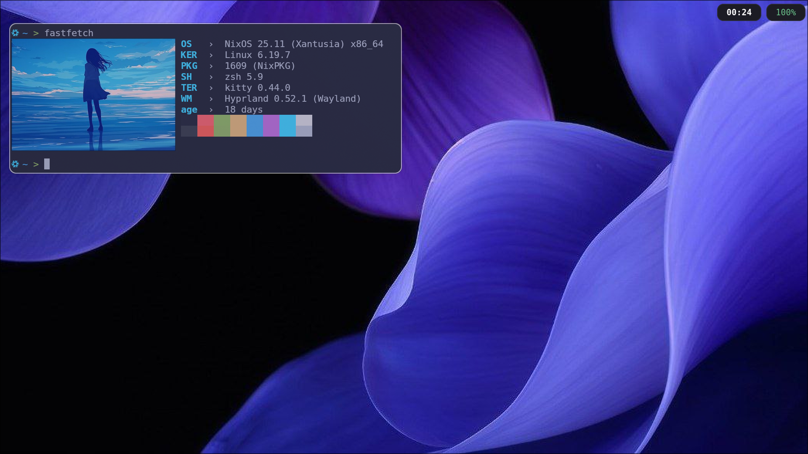

# dotfiles by noname from github

[](LICENSE)
[](https://zsh.org/)
[](https://www.shellcheck.net/)
[](https://hyprland.org)
[](https://github.com/Alexays/Waybar)
[](https://hg.sr.ht/~scoopta/wofi)
[](https://github.com/kovidgoyal/kitty)

# Requiments
* **WM:** 'Hyprland' (Wayland)
* **Status Bar** 'Waybar'
* **App Launcher** 'Wofi'
* **Terminal** 'Kitty'

# Preview


# How to install?🤔
```bash
git clone https://github.com/Tonyyyyz/dotfiles.git
cd dotfiles
chmod u+x install.sh
./install.sh
